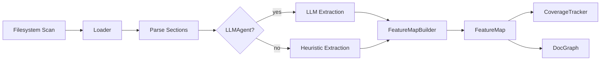

# DocProcessor Architecture

**Module:** `digital.vasic.docprocessor`

DocProcessor loads project documentation, extracts structured feature maps, tracks
verification coverage, and builds inter-document link graphs. It is designed for
injection into QA pipelines (e.g., HelixQA autonomous sessions) but also runs
standalone via `cmd/docprocessor`.

---

## Package Overview

| Package | Role |
|---------|------|
| `pkg/loader` | Document discovery and parsing |
| `pkg/feature` | Feature extraction and FeatureMap construction |
| `pkg/coverage` | Thread-safe verification coverage tracking |
| `pkg/docgraph` | Inter-document link graph with export |
| `pkg/llm` | Injected LLM interface for intelligent extraction |
| `pkg/config` | Configuration from `.env` files |
| `pkg/i18n` | `Translator` contract for CLI message localization |

---

## Processing Pipeline



1. **Scan** — `loader.Scanner` walks the project tree using the format list from
   `pkg/config` (`HELIX_DOCS_FORMATS` env var; defaults to `md, yaml, html, adoc, rst`)
   and the `HELIX_DOCS_ROOT` setting.
2. **Load & Parse** — `loader.Loader` reads each file (max 10 MB), splits it into
   `Section` structs with headings, bodies, and cross-reference links. Active structured
   parsers exist for **Markdown** and **YAML** only; other accepted extensions are stored
   as raw content with the first line as the title.
3. **Extract Features** — `feature.FeatureMapBuilder` runs heuristic extraction by
   default. When an `llm.LLMAgent` is injected it calls `ExtractFeatures` on the
   agent and parses `RawFeature` responses.
4. **Build FeatureMap** — Extracted features are deduplicated (deterministic IDs via
   `GenerateID`), categorised, and assembled into a queryable `FeatureMap` with a
   platform matrix.
5. **Enrich** — The optional LLM pass infers UI screens and generates test step
   suggestions for each feature.
6. **Track Coverage** — `coverage.CoverageTracker` records per-platform verification
   status, stores `Evidence`, and produces `CoverageReport` snapshots.

---

## Loader Pipeline

`loader.Loader` accepts a root path and a format list. Internally it uses:

- **Markdown parser** — extracts ATX/setext headings and fenced code blocks.
- **YAML parser** — unmarshals structured docs via `gopkg.in/yaml.v3`.

For other accepted extensions (html, adoc, rst) the loader stores raw content
with the first line used as the document title and a single top-level section.

All paths return `[]loader.Document` with `[]Section` slices.

---

## Feature Extraction

`feature.FeatureMapBuilder` operates in two modes:

- **Heuristic** — Keyword scoring against section headings and bodies to assign
  a `FeatureCategory` and detect platform tags (android, web, desktop).
- **LLM-powered** — Sends structured prompts to the injected `llm.LLMAgent` and
  deserialises the returned `[]RawFeature` slice into `Feature` structs.

Feature IDs are deterministic: short names become slugs; long names are slug + 6-char
SHA256 suffix, ensuring stable references across pipeline runs.

### FeatureCategory values

The eight valid categories defined in `pkg/feature/feature.go` are:

| Constant | Value |
|----------|-------|
| `CategoryFormat` | `format` |
| `CategoryUI` | `ui` |
| `CategoryNetwork` | `network` |
| `CategorySettings` | `settings` |
| `CategoryStorage` | `storage` |
| `CategoryAuth` | `auth` |
| `CategoryEditor` | `editor` |
| `CategoryOther` | `other` |

---

## Coverage Tracking

`coverage.CoverageTracker` is fully thread-safe:

- Read paths (`Coverage`, `CoverageByPlatform`, `CoverageByCategory`, `Unverified`) use `sync.RWMutex.RLock()`.
- Write paths (`MarkVerified`, `MarkFailed`, `MarkSkipped`, `RegisterFeature`) use `Lock()`.

A `CoverageReport` snapshot captures per-feature, per-platform status at a point in
time and is serialisable to JSON for downstream consumers (e.g., HelixQA reporter).

---

## DocGraph

`pkg/docgraph.DocGraph` maintains a directed graph of document nodes and typed edges
(reference, include, related). It is protected by `sync.RWMutex` and can export to:

- **JSON** — full node/edge list for programmatic consumers.
- **Mermaid** — `flowchart LR` diagram for documentation embedding.

---

## LLMAgent Interface

```go
type LLMAgent interface {
    ExtractFeatures(ctx context.Context, text string) ([]RawFeature, error)
}
```

The interface carries no module-level dependency on LLMOrchestrator or any concrete
provider. Callers inject a conforming implementation at construction time, keeping
DocProcessor buildable and testable without any LLM credentials.

The full `LLMAgent` interface in `pkg/llm/agent.go` also exposes `Summarize`,
`ClassifyFeature`, `InferScreens`, and `GenerateTestSteps`; `ExtractFeatures` is
the primary entry point for feature extraction.

---

## Key Exported Types

| Type | Package | Role |
|------|---------|------|
| `Loader` (interface) | `pkg/loader` | Load documents from the filesystem |
| `DefaultLoader` | `pkg/loader` | Concrete `Loader` implementation |
| `FeatureMapBuilder` (interface) | `pkg/feature` | Build and enrich `FeatureMap` from docs |
| `DefaultBuilder` | `pkg/feature` | Concrete `FeatureMapBuilder` implementation |
| `CoverageTracker` (interface) | `pkg/coverage` | Thread-safe coverage tracking |
| `DocGraph` | `pkg/docgraph` | Inter-document link graph |
| `LLMAgent` (interface) | `pkg/llm` | Injectable LLM for intelligent extraction |
| `Translator` (interface) | `pkg/i18n` | CLI message-localization contract |
